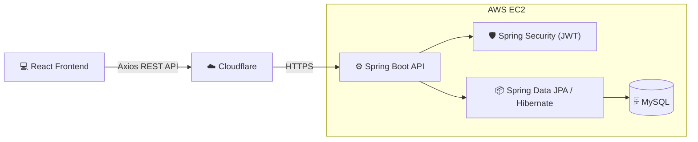

<h1 align="center">⚡ FlashLearn</h1>

<p align="center">
  <strong>A full-stack flashcard learning application built with Spring Boot and React, using the SuperMemo-2 (SM-2) spaced repetition algorithm to help users memorize vocabulary more efficiently.</strong>
<br>
<a href="https://henflashcard.eu.cc">🚀 Live Demo: https://henflashcard.eu.cc</a>
</p>

<p align="center">
  
  
  
  
  
  
</p>

---

## 🌟 Core Features

### 🧠 Spaced Repetition Learning
* **SuperMemo-2 (SM-2) Algorithm:** Intelligently calculates the next review date based on user performance to ensure maximum retention.
* **Smart Review System:** Automatically filters and displays only the flashcards that are due for review on the current day.
* **Learning Progress Tracking:** Tracks each user's learning progress across flashcards.

### 📚 Content Management
* **Deck CRUD:** Create, read, update, and delete personalized flashcard decks.
* **Flashcard CRUD:** Manage individual flashcards within specific decks.
* **Data Isolation:** Strict ownership enforcement ensuring users can only access and manage their own data.

### 🔐 Security & Architecture

* **JWT Authentication:** Stateless authentication using short-lived JWT access tokens.
* **Authorization:** Role- and permission-based authorization using Spring Security method security.
* **Refresh Token Rotation:** Refresh tokens are stored in `HttpOnly` cookies and rotated after each successful refresh request.
* **CSRF Protection:** Double-submit cookie pattern is used to protect state-changing refresh and logout requests.
* **Refresh Token Reuse Detection:** Each refresh token is assigned a unique `JTI` and grouped into a token family. Reusing an already-consumed refresh token automatically revokes the entire token family.
* **Concurrent Refresh Protection:** Refresh token consumption is performed atomically at the database level to prevent multiple concurrent requests from successfully consuming the same refresh token.
* **Token Revocation:** Invalidated refresh tokens and revoked token families are persisted and checked during authentication.
* **Password Security:** User passwords are securely hashed using BCrypt.
* **Data Isolation:** Repository-level ownership checks ensure users can only access their own decks and flashcards.
* **CORS:** Cross-Origin Resource Sharing is explicitly configured for trusted frontend origins.
* **RESTful Architecture:** RESTful APIs provide communication between the React frontend and Spring Boot backend.

---

## 🏗️ System Architecture



### Authentication Flow

FlashLearn uses short-lived access tokens with rotating refresh tokens.

```text
Login
  │
  ├── Access Token ──────► In-memory storage
  │
  └── Refresh Token ─────► HttpOnly Cookie
                              │
                              ▼
                       Access Token expires
                              │
                              ▼
                       POST /auth/refresh
                              │
                    ┌─────────┴─────────┐
                    │                   │
              CSRF validation      Token validation
                    │                   │
                    └─────────┬─────────┘
                              ▼
                    Atomic token consumption
                              │
                              ▼
                    New Access Token
                    + Rotated Refresh Token
                    
```

## 🔌 API Documentation

Below are some of the main REST APIs provided by the backend.

### Authentication

| Method | Endpoint | Description | Authentication |
|--------|----------|-------------|:--------------:|
| POST | `/api/auth/login` | Authenticate user and issue a short-lived access token and an HttpOnly refresh token cookie | ❌ |
| POST | `/api/auth/refresh` | Rotate the refresh token and issue a new access token | 🍪 |
| POST | `/api/auth/logout` | Revoke the current refresh token and invalidate the session | 🍪 |
| POST | `/api/users` | Register a new account | ❌ |

> 🍪 Refresh-token authentication is performed using an HttpOnly cookie.

### Deck Management

| Method | Endpoint | Description | Authentication |
|--------|----------|-------------|:--------------:|
| GET | `/api/decks` | Get all decks of the current user | ✅ |
| POST | `/api/decks` | Create a new deck | ✅ |
| GET | `/api/decks/{id}` | Get deck details | ✅ |
| PUT | `/api/decks/{id}` | Update a deck | ✅ |
| DELETE | `/api/decks/{id}` | Delete a deck | ✅ |

### Flashcard Management

| Method | Endpoint | Description | Authentication |
|--------|----------|-------------|:--------------:|
| GET | `/api/decks/{deckId}/cards` | Get all flashcards in a deck | ✅ |
| POST | `/api/decks/{deckId}/cards` | Create a flashcard | ✅ |
| PUT | `/api/cards/{cardId}` | Update a flashcard | ✅ |
| DELETE | `/api/cards/{cardId}` | Delete a flashcard | ✅ |

### Study

| Method | Endpoint | Description | Authentication |
|--------|----------|-------------|:--------------:|
| GET | `/api/study/decks/{deckId}` | Load flashcards due for review | ✅ |
| POST | `/api/study/review` | Submit a review result and update SM-2 progress | ✅ |

## 🗄️ Database Design

The database is designed using a normalized relational model to support:

- User authentication and authorization
- Flashcard deck and card management
- Per-user learning progress tracking
- Refresh token revocation and reuse detection

### Entity Relationship Diagram

<p align="center">
    
</p>

### Key Relationships

- **User → Deck:** A user can own multiple flashcard decks.
- **Deck → FlashCard:** A deck contains multiple flashcards.
- **User → LearningProgress:** Learning progress is tracked independently for each user and flashcard.
- **User ↔ Role:** Users can have multiple roles through a many-to-many relationship.
- **Role ↔ Permission:** Roles can contain multiple permissions through a many-to-many relationship.
- **InvalidatedToken:** Stores consumed refresh tokens using their unique `JTI`.
- **InvalidatedTokenFamily:** Stores revoked refresh-token families to invalidate all tokens belonging to a compromised session.

### Token Security Model

Refresh tokens are organized into token families.

Each refresh token contains:
- A unique `JTI`
- A `familyId`
- An expiration time

When a refresh token is successfully used, its `JTI` is atomically consumed and stored in `InvalidatedToken`.

If a previously consumed refresh token is reused, the entire token family is revoked through `InvalidatedTokenFamily`.

This design provides protection against refresh-token replay attacks while also handling concurrent refresh requests safely at the database level.

## 📸 Screenshots

### 🏠 Home


---

### 🔐 Login


---

### 📚 My Decks


---

### 🧠 Study Mode


## 🛠️ Tech Stack & Infrastructure

### Application

* **Backend:** Java 21, Spring Boot 3.x, Spring Security, Spring Data JPA, Hibernate
* **Frontend:** React, Vite, Axios, Ant Design
* **Database:** MySQL 8
* **Authentication:** JWT, OAuth2 Resource Server
* **Testing:** JUnit 5, Mockito, Spring Boot Test, MockMvc

### DevOps & Cloud Deployment
* **Containerization:** Docker & Docker Compose (with persistent volumes)
* **CI/CD Pipeline:** Fully automated deployments using **GitHub Actions**. Pushes to the `main` branch trigger image builds on Docker Hub and auto-deploy to the server.
* **Cloud Infrastructure:** Hosted on **AWS EC2**.
* **Proxy & DNS:** Managed via **Cloudflare** for DNS management and SSL.
* **Frontend Hosting:** Deployed edge-ready on **Vercel**.

### Testing

The project includes automated tests covering core business logic, REST APIs, authentication, authorization, and security scenarios.

* **Unit Testing:** JUnit 5 and Mockito for service-layer business logic.
* **Web Layer Testing:** MockMvc for REST controller testing.
* **Integration Testing:** Spring Boot test context for security and application integration.
* **Security Testing:** Authentication, authorization, CSRF protection, token expiration, refresh token rotation, and token reuse detection.
* **Concurrency Testing:** Concurrent refresh requests are tested to verify atomic refresh-token consumption.
* **CI Validation:** All automated tests are executed in the CI pipeline before deployment.
---

## 🚀 Getting Started (Local Development)

### 1. Prerequisites

Ensure you have the following installed on your local machine:

* **Java:** JDK 21
* **Node:** Node.js 20+
* **Package Manager:** npm
* **Build Tool:** Maven 3.9+
* **Docker:** Docker Desktop with Docker Compose
* **IDE:** IntelliJ IDEA (Backend) & VS Code (Frontend)

### 2. Environment Variables

The application provides default values for local development, so no environment variables are required to run the project locally.

For custom configuration, the following environment variables can be provided:

#### Backend

```env
DBMS_CONNECTION=jdbc:mysql://localhost:3307/flashcard_service?useAffectedRows=true
DBMS_USERNAME=root
DBMS_PASSWORD=root
JWT_SIGNER_KEY=your_super_secret_key_here
COOKIE_NAME=refresh_token
COOKIE_SECURE=false
```

#### Frontend (`.env`)
Create a `.env` file in the root of the React project:
```env
VITE_API_URL=http://localhost:8080/flashcard
```

### 3. Running the Application

#### Starting the Database with Docker Compose
From the project root, start the application:

```bash
docker compose up -d
```
This starts:

* MySQL 8 database
* Spring Boot backend

*The API will be accessible at `http://localhost:8080/flashcard`*

#### Starting the Frontend
Navigate to the frontend directory and run:
```bash
npm install
npm run dev
```
*The web interface will be accessible at `http://localhost:5173`*

---

## 📈 Future Enhancements

* Interactive learning analytics dashboard
* Public deck sharing
* CSV import/export
* Flashcard search and filtering
* Multimedia support (images/audio)
* Admin dashboard
---
*Developed with ❤️ as a modern, scalable full-stack application.*
