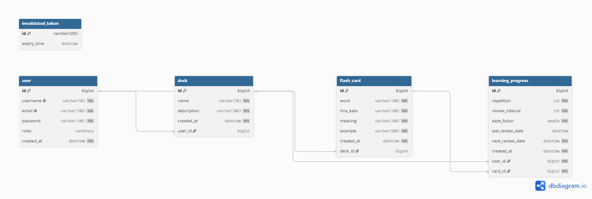
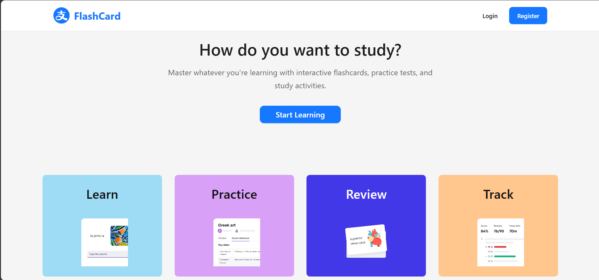
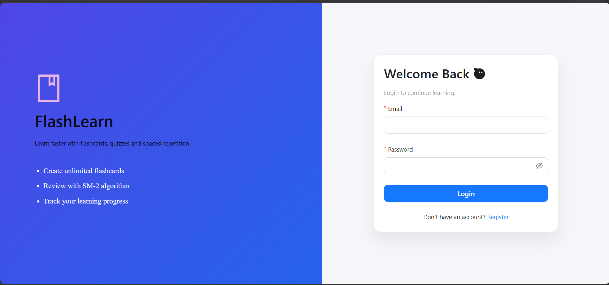
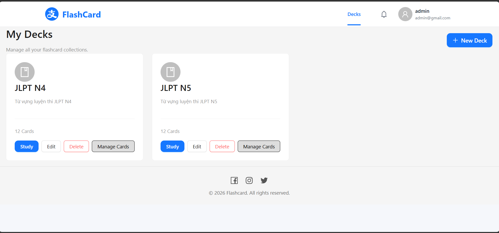
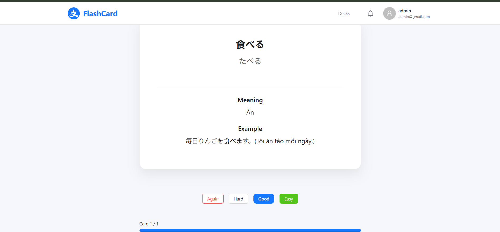

<h1 align="center">⚡ FlashLearn</h1>

<p align="center">
  <strong>A full-stack flashcard learning application built with Spring Boot and React, using the SuperMemo-2 (SM-2) spaced repetition algorithm to help users memorize vocabulary more efficiently.</strong>
<br>
<a href="https://henflashcard.eu.cc">🚀 Live Demo: https://henflashcard.eu.cc</a>
</p>

<p align="center">
  
  
  
  
  
  
</p>

---

## 🌟 Core Features

### 🧠 Spaced Repetition Learning
* **SuperMemo-2 (SM-2) Algorithm:** Intelligently calculates the next review date based on user performance to ensure maximum retention.
* **Smart Review System:** Automatically filters and displays only the flashcards that are due for review on the current day.
* **Learning Progress Tracking:** Monitors and Tracks each user's learning progress across flashcards.

### 📚 Content Management
* **Deck CRUD:** Create, read, update, and delete personalized flashcard decks.
* **Flashcard CRUD:** Manage individual flashcards within specific decks.
* **Data Isolation:** Strict ownership enforcement ensuring users can only access and manage their own data.

### 🔐 Security & Architecture
* **Authentication:** Secure user registration and login using JWT (JSON Web Tokens).
* **Password Encryption:** Strong password hashing implemented via BCrypt.
* **RESTful Architecture:** RESTful APIs for communication between the React frontend and Spring Boot backend.
* **CORS Configured:** Secure cross-origin resource sharing configured for production and local environments.

---

## 🏗️ System Architecture

```mermaid
graph LR
    Client["💻 React Frontend"]
        -->|"Axios REST API"|
    Cloudflare["☁️ Cloudflare"]

    Cloudflare
        -->|"HTTPS"|
    Backend["⚙️ Spring Boot API"]

    subgraph AWS EC2
        Backend --> Security["🛡️ Spring Security (JWT)"]
        Backend --> JPA["📦 Spring Data JPA / Hibernate"]
        JPA --> DB[("🗄️ MySQL")]
    end
```

## 🔌 API Documentation

Below are some of the main REST APIs provided by the backend.

| Method | Endpoint | Description | Authentication |
|--------|----------|-------------|:--------------:|
| POST | `/api/auth/login` | Authenticate user and return JWT | ❌ |
| POST | `/api/users` | Register a new account | ❌ |
| GET | `/api/decks` | Get all decks of current user | ✅ |
| POST | `/api/decks` | Create a new deck | ✅ |
| GET | `/api/decks/{id}` | Get deck details | ✅ |
| PUT | `/api/decks/{id}` | Update deck | ✅ |
| DELETE | `/api/decks/{id}` | Delete deck | ✅ |
| GET | `/api/decks/{deckId}/cards` | Get all flashcards in a deck | ✅ |
| POST | `/api/decks/{deckId}/cards` | Create a flashcard | ✅ |
| POST | `/api/study/review` | Submit a review result (SM-2) | ✅ |


## 🗄️ Database Design

The database is designed using a normalized relational model to support authentication, flashcard management, and the SM-2 spaced repetition algorithm.

### Entity Relationship Diagram

<p align="center">
    
</p>

## 📸 Screenshots

### 🏠 Home



---

### 🔐 Login



---

### 📚 My Decks



---

### 🧠 Study Mode




## 🛠️ Tech Stack & Infrastructure

### Application
* **Backend:** Java 21, Spring Boot 3.x, Spring Security, Spring Data JPA, Hibernate
* **Frontend:** React, Vite, Node.js 20+
* **Database:** MySQL 8

### DevOps & Cloud Deployment
* **Containerization:** Docker & Docker Compose (with persistent volumes)
* **CI/CD Pipeline:** Fully automated deployments using **GitHub Actions**. Pushes to the `main` branch trigger image builds on Docker Hub and auto-deploy to the server.
* **Cloud Infrastructure:** Hosted on **AWS EC2**.
* **Proxy & DNS:** Managed via **Cloudflare** (Cloudflare for DNS management and SSL.).
* **Frontend Hosting:** Deployed edge-ready on **Vercel**.

---

## 🚀 Getting Started (Local Development)

### 1. Prerequisites
Ensure you have the following installed on your local machine:
* **Java:** JDK 21
* **Node:** Node.js 20+ and npm/yarn
* **Build Tool:** Maven 3.9+
* **Database:** MySQL 8.x (or Docker Desktop to run via container)
* **IDE:** IntelliJ IDEA (Backend) & VS Code (Frontend)

### 2. Environment Variables
You will need to configure environment variables for both the backend and frontend to run the application locally.

#### Backend (`application.yml` or `.env`)
Create a `.env` file in the root of the Spring Boot project or inject these into your configuration:
```env
DB_URL=jdbc:mysql://localhost:3306/flashlearn
DB_USERNAME=root
DB_PASSWORD=root

JWT_SIGNER_KEY=your_super_secret_key_here_must_be_long_enough

SERVER_PORT=8080
SERVER_CONTEXT_PATH=/flashcard
```

#### Frontend (`.env`)
Create a `.env` file in the root of the React project:
```env
VITE_API_URL=http://localhost:8080/flashcard
```

### 3. Running the Application

#### Starting the Database (via Docker)
If you prefer not to install MySQL locally, you can spin it up quickly using Docker:
```bash
docker run --name flashlearn-db -e MYSQL_ROOT_PASSWORD=root -e MYSQL_DATABASE=flashlearn -p 3306:3306 -d mysql:8
```

#### Starting the Backend
Navigate to the backend directory and run:
```bash
mvn clean install
mvn spring-boot:run
```
*The API will be accessible at `http://localhost:8080/flashcard`*

#### Starting the Frontend
Navigate to the frontend directory and run:
```bash
npm install
npm run dev
```
*The web interface will be accessible at `http://localhost:5173`*

---

## 📈 Future Enhancements
* Incorporate interactive charts for deeper learning analytics.
* Add user roles (e.g., Admin dashboard).
* Support multimedia (images/audio) within flashcards.
* Search flashcards
* Public deck sharing
* CSV import/export
* Learning statistics dashboard
---
*Developed with ❤️ as a modern, scalable full-stack application.*
